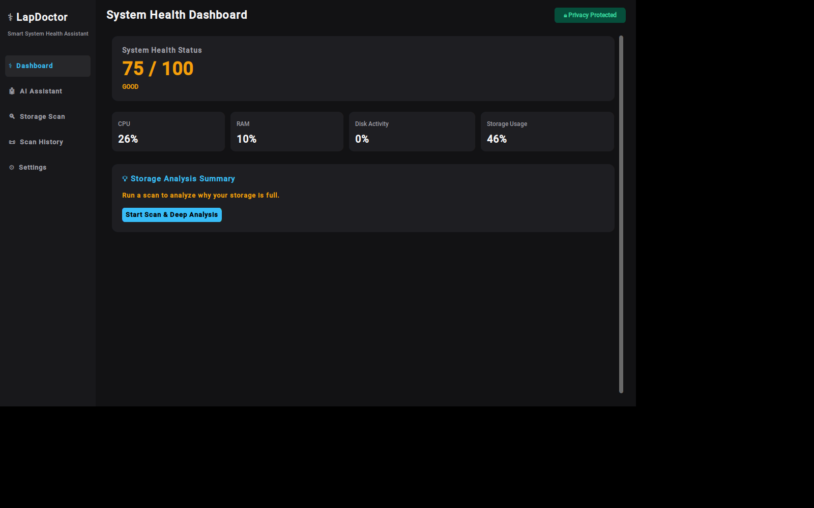
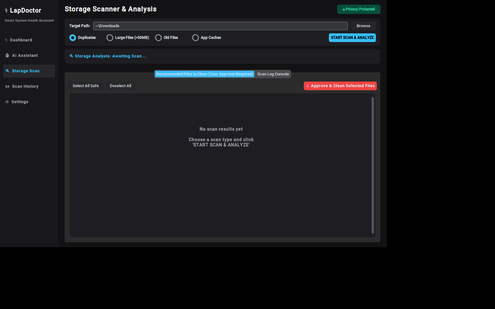
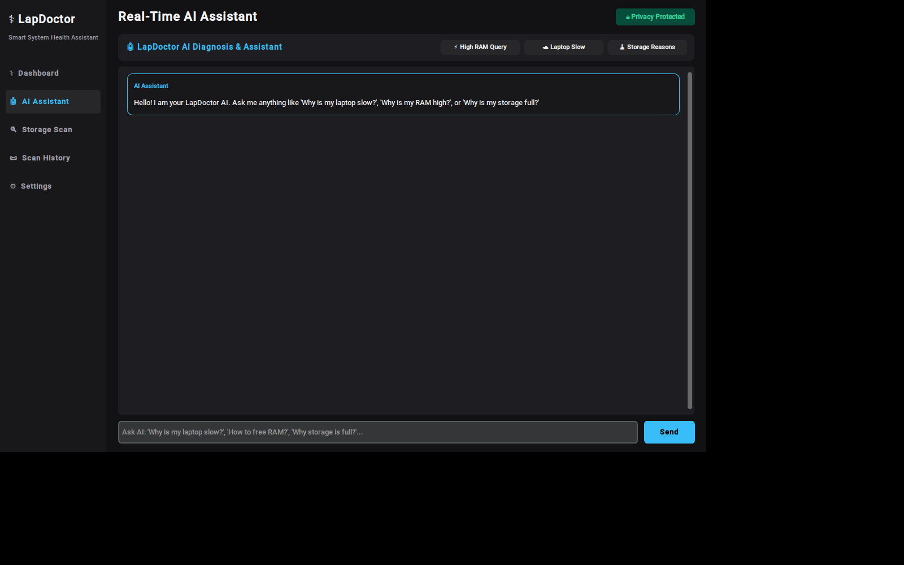

# 🩺 LapDoctor — Smart System Health Assistant

A desktop app that scans your own laptop for duplicate files, large files,
old/stale files, and app cache junk — and uses a real AI model (Gemini),
grounded in your actual live system stats and scan results, to explain what
it finds and answer questions about your PC. Everything runs locally; no
files are ever uploaded anywhere.



## ✨ Features

- **Duplicate file finder** — size → hash comparison, finds byte-identical
  files across folders (something Windows has no built-in tool for).
- **Large file / old file / app cache scanners**, each reviewable before
  anything is deleted — nothing is ever removed without your explicit
  approval.
- **Live system health dashboard** — real CPU / RAM / disk / storage
  numbers via `psutil`, rolled into a single health score.
- **AI Assistant, grounded in your real data** — not a generic chatbot.
  Every answer is generated with your laptop's live stats and latest scan
  results injected into the prompt, so it can actually explain *your*
  numbers and *your* files instead of giving generic advice.
- **Smart Cleaning alerts** — a background check that watches real disk
  usage and Downloads-folder junk size, and proactively notifies you when
  it's worth cleaning up.

| Storage Scan | AI Assistant |
|---|---|
|  |  |

## 🚀 Getting Started

### 1. Install dependencies
```bash
pip install -r requirements.txt
```

### 2. Add your Gemini API key
Open `core/ai_assistant.py`, find this near the top of the file:
```python
GEMINI_API_KEY = ""
```
Paste your key between the quotes. Get a free one at
[aistudio.google.com/apikey](https://aistudio.google.com/apikey) — no
credit card required.

*(Alternative: set an environment variable named `GEMINI_API_KEY` instead
of editing the file — it takes priority automatically.)*

### 3. Run it
```bash
python gui.py
```

## 🧪 Running the tests

```bash
pip install pytest
pytest tests/ -v
```

Covers the core duplicate-detection/hashing logic in `core/duplicate.py` —
hash correctness, chunked reads on large files, same-size-but-different-content
files correctly *not* being flagged as duplicates, skip-folder behavior, and
recoverable-space reporting.

## 📦 Building a standalone .exe (Windows)

You don't need Python installed to *run* the packaged app — only to build
it. On a **Windows machine**, from inside the `mp/` folder:

```
build_exe.bat
```

or manually:
```bash
pip install -r requirements.txt pyinstaller
pyinstaller LapDoctor.spec
```

The finished app will be at `dist/LapDoctor/LapDoctor.exe` — a single
double-click-to-run folder you can share, no Python required on the
machine running it.

> **Note:** PyInstaller builds for whatever OS it's run on — it can't
> cross-compile a Windows `.exe` from macOS/Linux. Run the build step
> itself on Windows.

## 🗂 Project structure

```
mp/
├── gui.py                 # Main application (customtkinter GUI)
├── core/
│   ├── duplicate.py        # Duplicate file detection (size → hash)
│   ├── large_files.py      # Large file scanner
│   ├── old_files.py        # Stale/old file scanner
│   ├── app_analyzer.py     # Cache/temp folder scanner
│   ├── cleanup.py          # Safe file deletion (Recycle Bin, not permanent)
│   ├── system_monitor.py   # Live CPU/RAM/disk/storage via psutil
│   └── ai_assistant.py     # Gemini API integration + system-context prompt
├── tests/
│   └── test_duplicate.py   # Unit tests for the hashing/duplicate logic
├── requirements.txt
├── LapDoctor.spec           # PyInstaller build spec
└── build_exe.bat            # One-click Windows .exe build script
```

## 🔒 Privacy

Everything runs entirely on your own machine. The only network calls this
app makes are to the Gemini API when you use the AI Assistant tab — your
system stats and scan results are sent as context for that specific
question, and nothing else is ever transmitted.

## 📝 License

MIT
